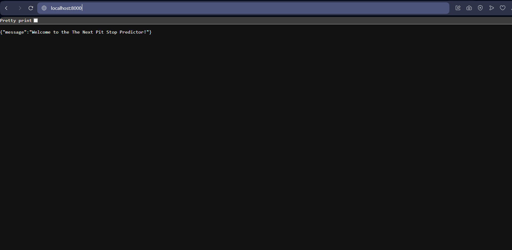
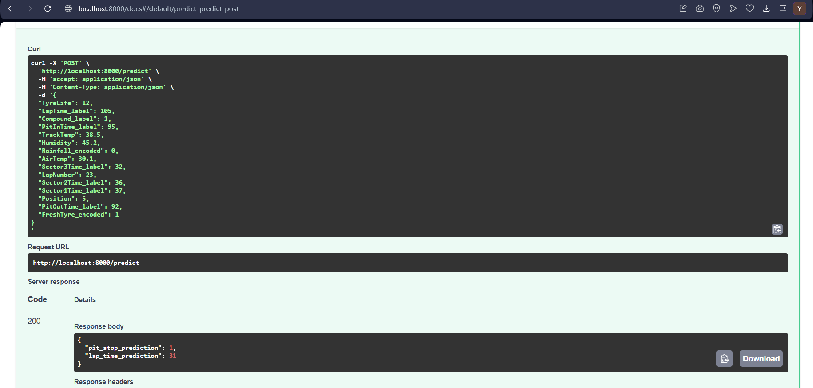

# F1 Pit Stop Prediction API 🏎️

A machine learning-powered API that predicts Formula 1 pit stop timing using real-time race data. This project combines data engineering, machine learning, and web API development to provide strategic insights for F1 race analysis.

##  Project Overview

This project implements a two-stage prediction system:
1. **Binary Classifier**: Predicts whether a car will make another pit stop (`WillPitAgain`)
2. **XGBoost Regressor**: Predicts the number of laps until the next pit stop (`NextPit`)

##  Data Pipeline

### Data Source
- **FastF1 API**: Utilized the FastF1 Python library to extract comprehensive Formula 1 race data
- **Data Coverage**: Lap times, tire information, weather conditions, driver positions, and pit stop events
- **Real-time Compatibility**: Pipeline designed to work with live race data

### Data Preprocessing
The preprocessing pipeline includes several key transformations:

1. **One-Hot Encoding**: Categorical variables (tire compounds, race names, drivers) were converted to numerical format using one-hot encoding
2. **Boolean Conversion**: All boolean features were standardized to binary format (1 for True, 0 for False)
3. **Feature Engineering**: 
   - Created `WillPitAgain` target variable for classification
   - Generated `NextPit` target variable for regression
   - Derived additional features like tire life and performance metrics
4. **Data Cleaning**: Handled missing values and outliers to ensure model reliability

### Key Features Used
- **Tire Data**: Tire life, compound type, fresh tire indicator
- **Performance Metrics**: Lap times, sector times, position
- **Environmental Conditions**: Air temperature, track temperature, humidity, rainfall
- **Race Context**: Lap number, pit in/out times

##  Machine Learning Models

### Model Architecture
- **Classifier**: XGBoost Classifier for binary pit stop prediction
- **Regressor**: XGBoost Regressor for lap count prediction

### Model Performance
- **Classification Accuracy**: High precision in predicting pit stop likelihood
- **Regression Metrics**: Low RMSE and MAE for lap count predictions
- **Cross-Validation**: 5-fold CV ensuring model generalizability
- **Feature Selection**: Importance-based feature selection to optimize performance
- **Hyperparameter Tuning**: GridSearchCV for optimal model parameters

##  API Usage

### Endpoints

#### Health Check
```
GET /
```
Returns a welcome message confirming the API is running.

#### Prediction
```
POST /predict
```

**Request Body:**
```json
{
    "TyreLife": 15,
    "LapTime_label": 85.234,
    "Compound_label": 2,
    "PitInTime_label": 0,
    "TrackTemp": 45.5,
    "Humidity": 60.0,
    "Rainfall_encoded": 0,
    "AirTemp": 28.5,
    "Sector3Time_label": 28.123,
    "LapNumber": 25,
    "Sector2Time_label": 27.456,
    "Sector1Time_label": 29.789,
    "Position": 5,
    "PitOutTime_label": 0,
    "FreshTyre_encoded": 0
}
```

**Response:**
```json
{
    "pit_stop_prediction": 1,
    "lap_time_prediction": 8
}
```

## 🐳 Docker Setup

### Prerequisites
- Docker installed on your system
- Git for cloning the repository

### Building and Running the API

1. **Clone the Repository**
   ```bash
   git clone https://github.com/YassineBen-Yahia/Formula-1-Pit-Stop-Prediction.git
   cd z3
   ```

2. **Build the Docker Image**
   ```bash
   docker build -t f1-pit-prediction .
   ```

3. **Run the Container**
   ```bash
   docker run -p 8000:8000 f1-pit-prediction
   ```

4. **Access the API**
   - Open your browser and navigate to `http://localhost:8000`
   - API documentation available at `http://localhost:8000/docs`
   - Interactive API testing at `http://localhost:8000/redoc`

### Docker Configuration
The Dockerfile is configured to:
- Use Python 3.10 slim base image for optimal performance
- Install all dependencies from `requirements.txt`
- Expose the API on port 8000
- Run with Uvicorn ASGI server for production-ready performance


### Development Setup

1. **Fork**
   ```bash
   git fork https://github.com/YassineBen-Yahia/Formula-1-Pit-Stop-Prediction.git
   
   cd f1 pit stop
   ```

2. **Set Up Development Environment**
   ```bash
   # Create virtual environment
   python -m venv venv
   
   # Activate virtual environment
   # Windows
   venv\Scripts\activate
   # Linux/Mac
   source venv/bin/activate
   
   # Install dependencies
   pip install -r requirements.txt
   ```

3. **Run Development Server**
   ```bash
   uvicorn app:app --host 0.0.0.0 --port 8000 --reload
   ```

### Using Docker for Development

1. **Build Development Image**
   ```bash
   docker build -t f1-pit-prediction-dev .
   ```

2. **Run with Volume Mounting** (for live code changes)
   ```bash
   docker run -p 8000:8000 -v $(pwd):/app f1-pit-prediction-dev
   ```

3. **Test the API**
   ```bash
   # Test health endpoint
   curl http://localhost:8000/
   
   # Test prediction endpoint
   curl -X POST "http://localhost:8000/predict" \
        -H "Content-Type: application/json" \
        -d '{
          "TyreLife": 15,
          "LapTime_label": 85.234,
          "Compound_label": 2,
          "TrackTemp": 45.5,
          "Humidity": 60.0,
          "Position": 5
        }'
   ```


##  Project Structure

```
f1 pit stop/
├── app.py                    # FastAPI application
├── Dockerfile               # Docker configuration
├── requirements.txt         # Python dependencies
├── README.md               # Project documentation
├── extracting_data.ipynb   #creating a data pipeline using fastf1 api
├── data_preprocessing.ipynb    #data preprocessing
├── model_training.ipynb    # ML model development notebook
├── processed_data/         # Preprocessed datasets
│   └── df_encoded.csv     # Main training dataset
├── classifier_model.pkl   # Trained classification model
├── final_xgboost_model.pkl # Trained regression model
└── f1_merged_data.csv

```

##  Technical Stack

- **Backend**: FastAPI, Python 3.10
- **Machine Learning**: XGBoost, Scikit-learn, Pandas, NumPy
- **Data Source**: FastF1 API
- **Deployment**: Docker, Uvicorn
- **Development**: Jupyter Notebooks, Git

## API Screenshots

### API Root Endpoint (`/`)


### API Documentation (`/docs`) with an example of a prediction



